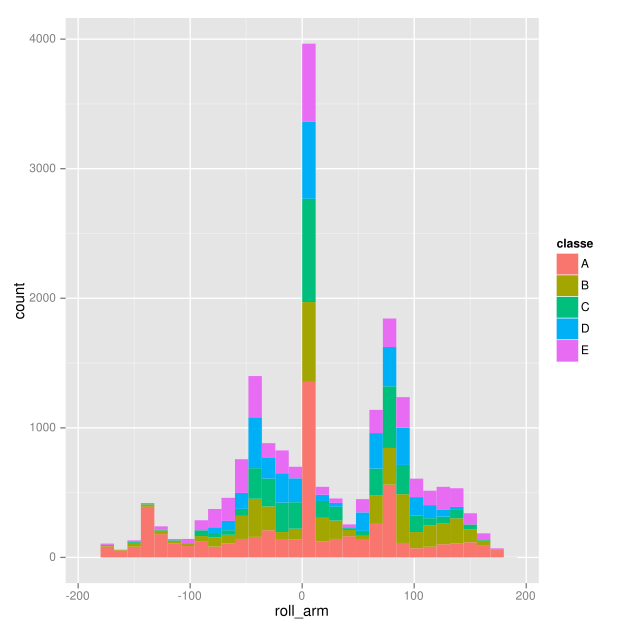
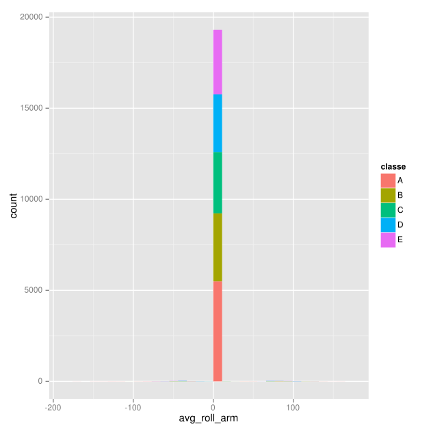
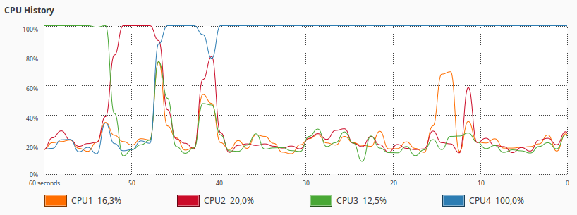

Practical Machine Learning Course Submission
============================================

Stephan Heijl, 14/05/2015

This is my submission for the Practical Machine Learning Course. I
approached this project in the following fashion:

1.  [Exploratory Data visualization using Weka](#exp-data-vis)
2.  [Data preprocessing](#data-pre-proc)
    1.  [Low variation data exclusion](#low-var-data)
    2.  [Principal Component Analysis](#pca)

3.  [Testing different types of machine learning
    algorithms](#mla-testing)
4.  [Optimization of Random Trees algorithm](#rt-optimization)
5.  [Prediction result analysis](#pre-res-ana)
6.  [Complete R Script](#r-script)
7.  [References](#references)

Exploratory Data visualization using GGPlot
-------------------------------------------

The PML training set consists of over a hundred of different variables.
Using GGPlot, I could easily visualize the data to explore any obvious
patterns and necessary preprocessing steps. One of the most relevant
discoveries was related to the variation within the data. A large amount
of attributes showed very little variance within their values. If this
data is used for prediction, small outliers may significantly bias the
predictor by inducing overfitting on that variable. An example is given
in figure 1, below.

 

Figure 1. The left diagram shows a variable distribution for the
`roll\_arm` attribute. There is plenty of variation in the data. The right
diagram shows the distribution for `avg\_roll\_arm`. We can see that there
is no real variation across the data. This makes this attribute
unsuitable for prediction, as it can lead to overfitting. These diagrams
were generated with the following code: `ggplot(allData, aes(x=attribute,
fill=classe)) + geom\_histogram().`

Data preprocessing
------------------

Data preprocessing involved several steps. First, NA values were
replaced with 0 by using the following command: `sed 's/NA/o/g'
./pml-training.csv \> ./pml-training-nona.csv`. This yields a csv file
without the NA, which were causing problems when loading.

In addition, before any training takes place, the columns containing
metadata were filtered from the training and test sets. These columns
included the ID, the username, the window columns, and the timestamps.
The username was picked as metadata, as the person executing the
training excercise seemed unlikely to affect the classe of the
assignment. Additionally, the name of the person executing a training
excercise has very little impact on any results when applying this model
to a real life situation.

### Low variation data exclusion

As mentioned in the exploratory data visualization section, a large
array of variables can be shown not contain significant variation in
their data. This results in data that is either useless for machine
learning, since its presence does not indicate a certain class, or can
even lead to overfitting. Using R's `NearZeroVar` function allowed me to
filter these attributes, resulting in a leaner, more relevant dataset.
As a pleasant side effect, having less attributes to train on yielded
lower training times. The `freqCut` argument was set to 95/45, as it
yielded the best filtered results upon visual inspection of the data
variation.

### Principal Component Analysis

The initial data visualization step revealed a number of attributes
showed very similar patterns. With principal component analysis we can
merge these attributes to a more compact, more bias resistant variable.
This also yields a reduced amount of attributes, improving training
speeds.

Testing different types of machine learning algorithms
------------------------------------------------------

As our data is very much non-linear, I decided to select a number of
algorithms suited for this specific data distribution. The following
algorithms were selected:

-   RandomForest
-   Parallel Random Forest
-   AdaBoost (non-bagged)
-   AdaBoost (bagged)
-   Model Averaged Neural Network
-   Naive Bayes
-   Stochastic Gradient Boosting
-   Linear Discriminant Analysis

The Linear Discriminant Analysis Model was added as a benchmark, to find
how effective algorithms better suited for non-linear data perform
compared to linear optimized algorithms. The detailed results for each
of these algorithms can be found in the [Github
repository](https://github.com/StephanHeijl/Practical-Machine-Learning-Assignment).
The results are summarized in table 1. 

Table 1: This table shows both the accuracy and time performances for
10-fold cross validation for each of the algorithms. The last column
shows the time/performance ratio.

| Algorithm                     | Accuracy score | Time taken (seconds) | Seconds per percentage point | 
|-------------------------------|----------------|----------------------|------------------------------| 
| RandomForest                  | 0.9697         | 922.447              | 9.513                        | 
| Parallel Random Forest        | 0.9699         | 600.904              | 6.196                        | 
| AdaBag                        | 0.4138         | 1645.114             | 39.756                       | 
| Linear discriminant analysis  | 0.4678         | 6.530                | 0.14                         | 
| Stochastic Gradient Boosting  | 0.7574         | 533.162              | 7.039                        | 
| Adaboost                      | 0.6769         | 3823.220             | 56.481                       | 
| Model Averaged Neural Network | 0.5883         | 855.590              | 14.543                       | 
| Naive Bayes                   | 0.5574         | 125.745              | 2.256                        | 

Both algorithms based on RandomForest yield the highest accuracy scores
for the tests. The Parallel Random Forest algorithm, however was over
50% faster. This is further analyzed in the "Optimization of Random
Forest algorithm" section below.

Most bagged methods, including Neural networks and both AdaBoost based
functions scored comparatively poorly, especially considering the time
required for each to complete their training. This makes these
algorithms unsuitable in both aspects.

Interestingly, the linear discriminant analysis algorithm excelled at
speed, but yielded poor prediction results. This method could only be
preferred for very large datasets, where accuracy is trumped by a need
for fast results. The poor prediction fit does confirm the assessment of
the dataset as being non-linear.

In conclusion, the RandomForest based algorithms were chosen for further
analysis.

Optimization of Random Forest algorithm
---------------------------------------

The Random Forest algorithm depends on a large amount of trees being
generated. The default for the caret package is set to 300+ trees.
However, analysis using Weka [[1]](#cite-1) shows that using a smaller
amount of trees (\~100) results in very similar performance, with just a
few percentage points difference in accuracy. Using less trees for this
algorithm will result in faster training for neglible accuracy loss. The
caret package does not support changing the n\_trees argument for the
Random Forest algorithm.

An example of this is shown with the Parallel RandomForest algorithm.
This implementation has a lower n\_trees argument of 250. Profiling the
code unfortunately showed no real world parallelization in my instance,
but lowering the amount of trees still increased speeds by over 50%.
There was no significant impact on accuracy. I project a further
increase in speed if the parallelization is actually fully enabled.

Figure 2: Profiling CPU activity during the operations of ParRF showed
no simultaneous CPU usage throughout the run, but the different
parameters still yielded a speed increase.

Prediction result analysis
--------------------------

As the Parallel Random Forest algorithm showed the most promise, this is
what I will be using to predict the values for the test set. A full
analysis of the results produced by this algorithm is included below.

Table 2: This shows the confusion matrix for the results achieved by
parRF. A high amount of true positives can be found across the board.
These are based on the average scores for the cross validation, so the
total is a little bit off from the sample size of 19662.

| Prediction/Reference | A    | B    | C    | D    | E    | 
|----------------------|------|------|------|------|------| 
| A                    | 5435 | 98   | 39   | 20   | 20   | 
| B                    | 39   | 3591 | 59   | 20   | 39   | 
| C                    | 59   | 98   | 3257 | 157  | 39   | 
| D                    | 39   | 20   | 39   | 3002 | 39   | 
| E                    | 20   | 20   | 20   | 20   | 3512 | 

In conclusion, an overall accuracy of 96.99% was achieved in the cross
validation test, with a Kappa value of 96.2%. Based on the
cross-validation test, I estimate the out-of-sample error rate to be
approximately 3%. Based on the interpretations of multiple
researchers[[3]](#cite-3)[[4]](#cite-4) this constitutes an "Excellent"
or "Near perfect" conformance to the data. As such, I deem this model as
usable for the task at hand.

Complete R script
-----------------

~~~~
library(caret)
require(doParallel)
 
allData <- read.csv("pml-training-nona.csv",header=T) # Load training file
 
variantData <- allData[,-c(nearZeroVar( allData, saveMetrics=F, freqCut = 95/45))]
metaCols <- c(1,2,3,4,5,6) # Columns with metadata
trainingData <- variantData[-metaCols]
 
set.seed(1)
 
ctrl <- trainControl( preProcOptions = list(thresh = 0.8),
                        allowParallel=T,
                        savePredictions=T,
                        method = "repeatedcv",
                        number = 10
                        )
 
ptm <- proc.time() # Clock time taken
 
args<-commandArgs(TRUE) # Use of command line arguments allows for easier parallelization with a bash script.
trainingMethod <- args[1]
 
modelFit <- train( classe ~ ., data=trainingData, method=trainingMethod, trControl=ctrl, preProcess='pca' )
modelFit
 
proc.time() - ptm # Stop the timer and echo result
 
confusionMatrix(modelFit)
~~~~

References
----------

-   Mark Hall, Eibe Frank, Geoffrey Holmes, Bernhard Pfahringer, Peter
    Reutemann, Ian H. Witten (2009); The WEKA Data Mining Software: An
    Update; SIGKDD Explorations, Volume 11, Issue 1.
-   Pretty R syntax highlighter - http://www.inside-r.org/pretty-r/tool
-   The measurement of observer agreement for categorical data. - Landis
    JR, Koch GG. Biometrics. 1977 Mar;33(1):159-74.
-   The kappa statistic in reliability studies: use, interpretation, and
    sample size requirements. - Sim J1, Wright CC. Phys Ther. 2005
    Mar;85(3):257-68.

All contents, except where otherwise noted, are the work of Stephan
Heijl.\
 *In accordance with the Honor Code, I certify that my answers here are
my own work, and that I have appropriately acknowledged all external
sources (if any) that were used in this work.*
